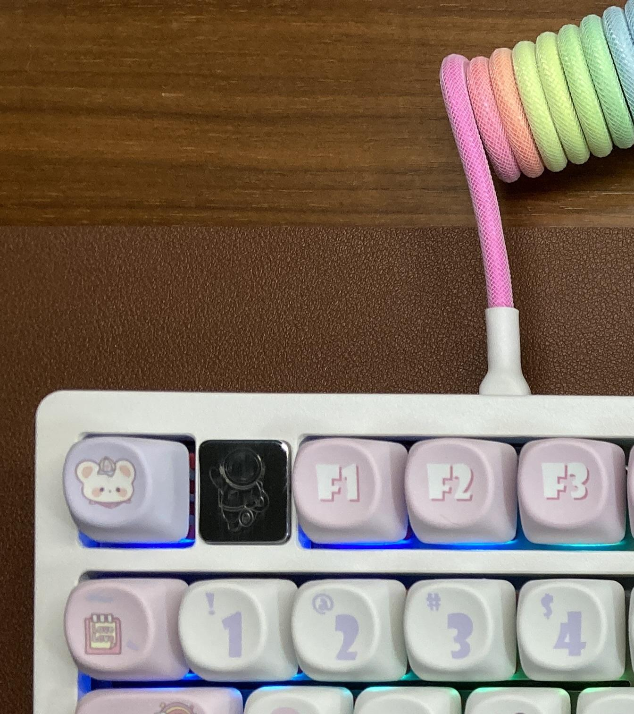
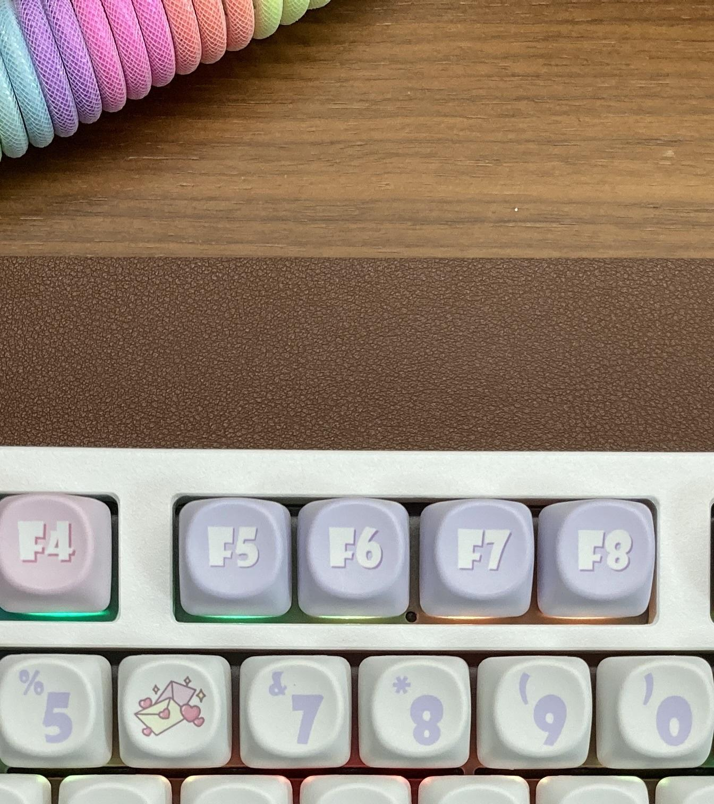
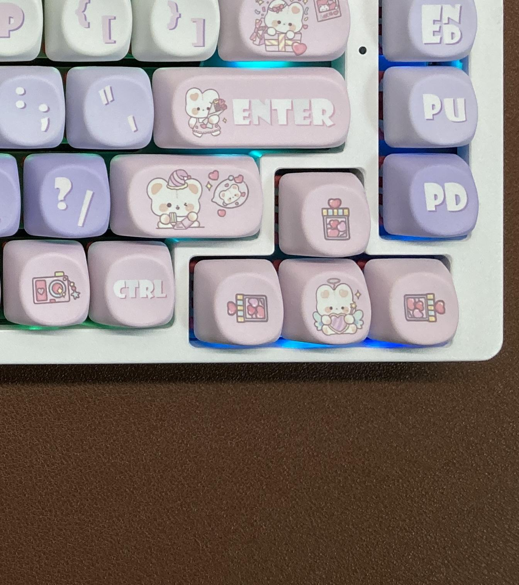

### Requirement library
- ubuntu 18.04: libjpeg-dev
- Debian Buster (BBB 2020-04-06): 

### Compile
``` sh
gcc -o split_jpeg split_jpeg.c -ljpeg
```

### 원본 이미지


### 실행
``` sh
./split_jpeg keyboard.jpg
```

### 분할된 이미지
  
  
